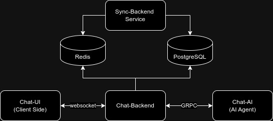

# Chat-AI-Service
A Service to write AI Agent Logic.

## System Flow Diagram




## Services

- [Sync-Backend](https://github.com/AI-at-Work/Sync-Backend)
- [Chat-UI](https://github.com/AI-at-Work/Chat-UI)
- [Chat-Backend](https://github.com/AI-at-Work/Chat-Backend)

## Getting Started

1. Clone the repository:
   ```bash
   git clone https://github.com/AI-at-Work/Chat-AI-Service
   cd Chat-AI-Service
   ```

2. Copy the `.env.sample` to `.env` and configure the environment variables:
   ```bash
   cp .env.sample .env
   ```
   Edit the `.env` file to set your specific configurations and add openai api key.

3. Start the service:
   ```bash
   make proto && docker-compose up -d --build
   ```

## Configuration

Key configuration options in the `.env` file:

- `AI_*`: AI Server configurations

Refer to the `.env.sample` file for a complete list of configuration options.

